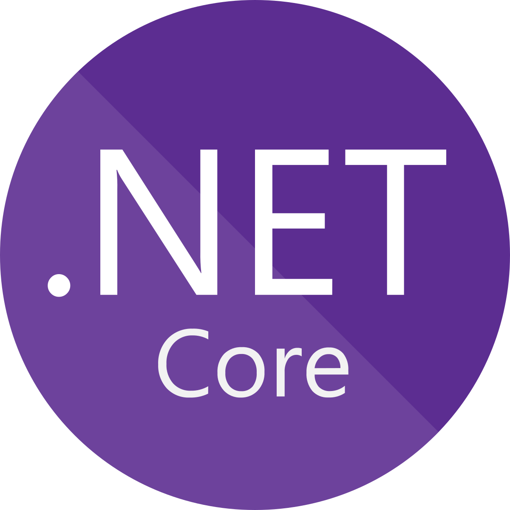

### Hi there, I'm Tamim - aka [tamim36][website] 👋

   

## I'm a Learner, Developer & Tech Enthusiast!!

- 🔭 I am currently solving problem on [LeetCode][course]!
- 🌱 I’m currently learning everything 🤣
- 👯 I’m looking to collaborate with open source porjects
- 🥅 2020 Goals: Contribute more to Open Source projects
- ⚡ Fun fact: I love to travel more and more

### Spotify Playing 🎧

 

### Languages and Tools:

[][webdevplaylist]
[][webdevplaylist]
[][cssplaylist]
[][cssplaylist]
[][jsplaylist]
[][webdevplaylist]
[][webdevplaylist]
[][webdevplaylist]
[][webdevplaylist]
[][webdevplaylist]
[][webdevplaylist]
[][webdevplaylist]

 
 
 
 

---

  
:zap: GitHub Stats

  

