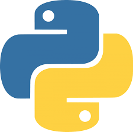

### Hi there, I'm Tamim - aka [tamim36][website] 👋

   

## I'm a Learner, Developer & Tech Enthusiast!!

- 🔭 I am currently solving problem on [LeetCode][course]!
- 🌱 I’m currently learning everything 🤣
- 👯 I’m looking to collaborate with open source porjects
- 🥅 2020 Goals: Contribute more to Open Source projects
- ⚡ Fun fact: I love to travel more and more

### Spotify Playing 🎧

 

### Languages and Tools:

[][webdevplaylist]
[][webdevplaylist]
[][cssplaylist]
[][cssplaylist]
[][jsplaylist]
[][webdevplaylist]
[][webdevplaylist]
[][webdevplaylist]
[][webdevplaylist]
[][webdevplaylist]
[][webdevplaylist]
[][webdevplaylist]

 
 
 
 

---

### 📺 Latest YouTube Videos

<!-- YOUTUBE:START -->
- [[#10] Don't MISS These Amazing Web Dev Videos! (STACKr News 2021, Issue #10)](https://www.youtube.com/watch?v=xDVgpW1tig4)
- [Top VS Code Updates | v1.54 Released!! | Tips & Tricks 2021 (Visual Studio Code)](https://www.youtube.com/watch?v=Qj6Jya9APiU)
- [[#9] 🤯 42 Amazing Web Dev Videos! #WomensHistoryMonth (STACKr News 2021, Issue #9)](https://www.youtube.com/watch?v=OSLyP8L0s_k)
- [Brackets is Dead | Switch to VS Code (Visual Studio Code Setup 2021)](https://www.youtube.com/watch?v=MQxLbUX5BFA)
- [[#8] Don't MISS These Amazing Web Dev Videos! (STACKr News 2021, Issue #8)](https://www.youtube.com/watch?v=tSSzfT5Txv8)
<!-- YOUTUBE:END -->

➡️ [more videos...](https://youtube.com/codestackr)

---

### 📕 Latest Blog Posts

<!-- BLOG-POST-LIST:START -->
- [How To Pass Application Tracking Systems (ATS) & Get Interviews - Resume Tips for Software Developer](https://dev.to/codestackr/how-to-pass-application-tracking-systems-ats-get-interviews-resume-tips-for-software-developer-4bmo)
- [Microinteractions: Password Validation Animation](https://dev.to/codestackr/microinteractions-password-validation-animation-5629)
- [Notion + YouTube - A Powerful Combination for Productivity](https://dev.to/codestackr/notion-youtube-a-powerful-combination-for-productivity-1def)
- [Regular Expressions (RegEx) Crash Course](https://dev.to/codestackr/regular-expressions-regex-crash-course-248n)
- [Emmet Part 2 - Advanced](https://dev.to/codestackr/emmet-part-2-advanced-4c65)
<!-- BLOG-POST-LIST:END -->

➡️ [more blog posts...](https://tamim.com)

---

  
:zap: Recent GitHub Activity

  
<!--START_SECTION:activity-->
1. ❗️ Closed issue [#8](https://github.com/codeSTACKr/free-developer-resources/issues/8) in [codeSTACKr/free-developer-resources](https://github.com/codeSTACKr/free-developer-resources)
2. 🗣 Commented on [#8](https://github.com/codeSTACKr/free-developer-resources/issues/8) in [codeSTACKr/free-developer-resources](https://github.com/codeSTACKr/free-developer-resources)
3. 🗣 Commented on [#7](https://github.com/codeSTACKr/free-developer-resources/issues/7) in [codeSTACKr/free-developer-resources](https://github.com/codeSTACKr/free-developer-resources)
4. 🎉 Merged PR [#7](https://github.com/codeSTACKr/free-developer-resources/pull/7) in [codeSTACKr/free-developer-resources](https://github.com/codeSTACKr/free-developer-resources)
5. 🗣 Commented on [#3](https://github.com/codeSTACKr/codestackr-vscode-theme/issues/3) in [codeSTACKr/codestackr-vscode-theme](https://github.com/codeSTACKr/codestackr-vscode-theme)
<!--END_SECTION:activity-->

  
:zap: GitHub Stats

  

[website]: https://codeSTACKr.com
[course]: http://vsCodeHero.com
[twitter]: https://twitter.com/codeSTACKr
[youtube]: https://youtube.com/codeSTACKr
[instagram]: https://instagram.com/codeSTACKr
[linkedin]: https://linkedin.com/in/codeSTACKr
[webdevplaylist]: https://www.youtube.com/playlist?list=PLkwxH9e_vrAJ0WbEsFA9W3I1W-g_BTsbt
[jsplaylist]: https://www.youtube.com/playlist?list=PLkwxH9e_vrALRJKu7wfXby3MKeflhTu6B
[cssplaylist]: https://www.youtube.com/playlist?list=PLkwxH9e_vrALSdvZuEh6gqQdmDoDIoqz4
[reactplaylist]: https://www.youtube.com/playlist?list=PLkwxH9e_vrAK4TdffpxKY3QGyHCpxFcQ0